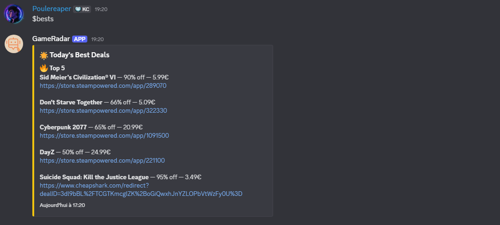

# GamesRadar

GamesRadar is a Discord bot that automatically tracks and notifies your server about the latest game deals and free games (for PC players) from Steam, CheapShark, and Epic Games Store. It is designed for gaming communities who want to stay up-to-date with the best offers and freebies.

---

## Install on your server

You can invite the bot to your Discord server using the following link:
[Invite GamesRadar](https://discord.com/oauth2/authorize?client_id=1417207388179661051&permissions=2252177771326464&integration_type=0&scope=bot)

If you wish to self-host the bot, please refer to the installation instructions at the end of this README.

---

## Features & Use Cases

- **Automatic Deal Notifications:** Get notified about new game discounts and free games directly in your Discord channel.
- **Multi-Store Support:** Tracks deals from Steam (most popular games), CheapShark (multiple stores), and Epic Games Store (weekly free games).
- **Custom Filters:** Set your own minimum discount, maximum price, and choose which stores to track.
- **Daily Best Deals:** Receive a daily summary of the top 5 deals and up to 3 free games.
- **Multi-language Support:** Available in English and French.
- **Per-Guild Configuration:** Each server can have its own notification channel and filter settings.


---

## What Can GamesRadar Do?

- Notify your server about new Steam, CheapShark, and Epic Games deals.
- Track only the deals that match your preferences (discount, price, store).
- Show the current best deals and free games on demand.
- Allow server admins to configure filters and notification settings.
- Support multiple languages for commands and notifications.



**Platforms supported with this bot, in theory :**

- Steam 
- GreenManGaming
- GOG 
- Humble Bundle
- GamersGate
- Epic Games
- Uplay

---

## Available Commands

- `$help` — Show help and available commands.
- `$lang fr/en` — Change the bot's language.
- `$status` — Check if the bot is online.
- `$setchannel` — Set the current channel as the notification channel (admin only).
- `$filters` — Show or edit filters (admin only).
- `$bests` — Show the current best deals.
- `$free` — Show the current free games.

---

## How to Use Filters

Filters allow you to customize which deals you receive notifications for. Only administrators can change filters.

**View current filters:**
```
$filters
```

**Edit filters:**
```
$filters min_discount=30 max_price=50 epic=on steam=off
```

**Available filter options:**
- `min_discount` — Minimum discount percentage (e.g., `min_discount=30`)
- `max_price` — Maximum price in euros (e.g., `max_price=50`)
- `best_discount` — Minimum discount for daily best deals
- `best_price` — Maximum price for daily best deals
- `epic` — Enable/disable Epic Games notifications (`epic=on` or `epic=off`)
- `steam` — Enable/disable Steam notifications
- `cheapshark` — Enable/disable CheapShark notifications
- `bestdeals` — Enable/disable daily best deals summary
- `silent` — Mute notifications (bot will still track deals)
- `notifs` — Notification interval (in multiples of 6 hours)
- `bestsnotifs` — Best deals notification interval (in multiples of 24 hours)

---

## Installation & Self-Hosting

1. **Clone the repository:**
   ```sh
   git clone https://github.com/Poulereaper/GamesSalesBot.git
   cd GamesSalesBot/src
    ```
2. **Create a virtual environment (optional but recommended):**
    ```sh
    python3 -m venv venv
    source venv/bin/activate  # On Windows use `venv\Scripts\activate`
    ```

3. **Install dependencies:**
    ```sh
    pip install -r requirements.txt
    ```
4. **Set up environment variables:**
    Create a `.env` file in the `src` directory with the following content:
    ```
    DISCORD_TOKEN=your_discord_bot_token
    ```
5. **Run the bot:**
    ```sh
    python3 main.py
    ```
6. **Invite the bot to your server:**
    Make sure the bot has permission to read/send messages and manage channels.

## Notes 
- The bot stores seen deals and guild configurations in seen.json and guilds.json in the working directory.
- Only server administrators can change notification channels and filters.
- For best results, run the bot on a server that is always online.

This project is open-source and contributions are welcome. It's a very basic implementation, so feel free to suggest improvements or add features!

## License
This project is licensed under the MIT License.

## Policy 
This bot is not affiliated with or endorsed Steam, Epic Games, or CheapShark. It is a third-party tool created for personal and community use. Use at "your own risk".

TO see the full policy or the terms of service of the bot, please refer to those links:
- [Terms of Service]([...](https://poulereaper.github.io/GamesSalesBot/))
- [Privacy Policy]([...](https://poulereaper.github.io/GamesSalesBot/))

## Contact
For any questions do not hesitate to contact me on Discord: poulereaper

